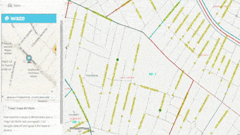

Embedded Waze widget
=================
Embedded Waze widget for the [Configurable Map Viewer (CMV)](https://github.com/cmv/cmv-app) app.
Built and tested with CMV 1.3.4.

Use by adding the following to viewer.js config file.
```javascript
embeddedWaze: {
    include: true,
    id: 'embeddedWaze',
    type: 'titlePane',
    canFloat: true,
    title: 'Waze',
    open : false,
    path: 'gis/dijit/EmbeddedWaze',
    options: 'config/embeddedWaze'
}
```

Sample:

